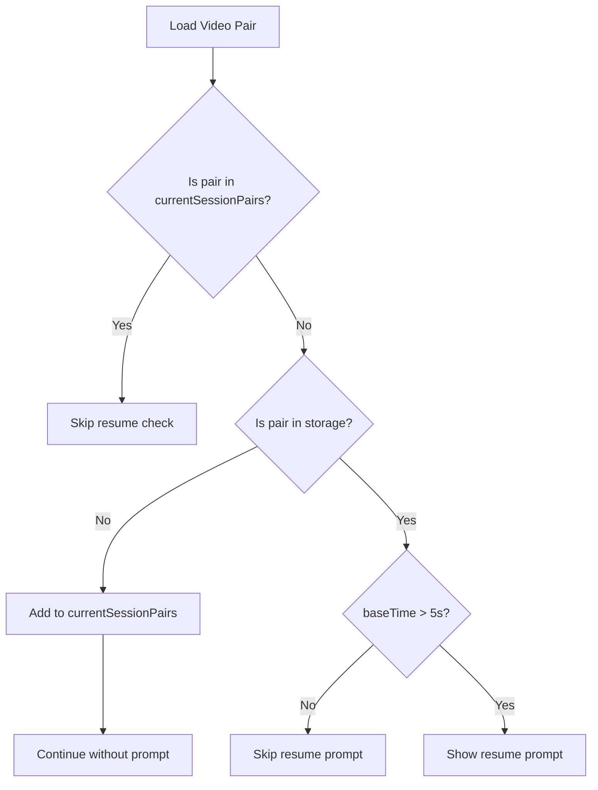

# Design Document: Reaction Sync Refinements

## Overview

This design document outlines the technical approach for refining the reaction-sync video player application. The improvements focus on four main areas:

1. **File Picker Enhancement** - Expanding video format support in the file picker
2. **Tips Screen Auto-Close** - Automatically dismissing the tips screen when loading videos
3. **Resume Prompt Bug Fix** - Preventing false resume prompts for new video pairs
4. **UI/UX Improvements** - Fixing control visibility issues and enhancing visual design

## Architecture

The changes primarily affect the following modules:

```
src/
├── ui/
│   ├── video-loading.ts  # File picker accept attribute
│   ├── menus.ts          # Tips screen auto-close integration
│   ├── controls.ts       # React controls positioning
│   └── toast.ts          # Resume prompt logic
├── storage.ts            # Session tracking for resume bug fix
├── styles.css            # UI visual improvements
└── main.ts               # Tips screen close on load
```

### Data Flow for Resume Prompt Fix



## Components and Interfaces

### 1. File Picker Enhancement

**Location:** `src/ui/video-loading.ts`

**Current Implementation:**
```typescript
input.accept = 'video/*'
```

**New Implementation:**
```typescript
// Comprehensive video format support
const VIDEO_ACCEPT = 'video/*,.mkv,.avi,.mov,.wmv,.flv,.m4v,.webm,.ogv,.3gp,.ts,.mts'
input.accept = VIDEO_ACCEPT
```

The `video/*` MIME type doesn't always include MKV and other container formats depending on the browser/OS. By explicitly listing extensions, we ensure all common formats appear in the file picker.

### 2. Tips Screen Auto-Close

**Location:** `src/ui/menus.ts` and `src/main.ts`

**Interface:**
```typescript
// Export closeTipsScreen for use in video loading
export function closeTipsScreen(): void
```

**Integration Points:**
- `promptLocalFile()` - Close tips before opening file picker
- `selectUrlSource()` - Close tips before showing URL prompt

### 3. Resume Prompt Bug Fix

**Location:** `src/storage.ts`

**New State:**
```typescript
// Track video pairs loaded in current session
const currentSessionPairs = new Set<string>()
```

**Modified Logic:**
```typescript
export async function checkForResume(): Promise<void> {
  if (prompted || isLoadingSession) return
  const key = getPairKey()
  if (!key) return
  
  // NEW: Skip if this pair was loaded fresh in current session
  if (currentSessionPairs.has(key)) return
  
  const session = await loadSession(key)
  if (!session) return
  if (Date.now() - session.updatedAt > TTL) return
  if (session.baseTime < 5) return
  
  prompted = true
  showResumePrompt(...)
}

// NEW: Mark pair as loaded in current session
export function markPairAsNew(): void {
  const key = getPairKey()
  if (key) currentSessionPairs.add(key)
}
```

### 4. UI Improvements

#### 4.1 Base Video Controls Spacing

**Problem:** The transparent gradient controls overlap the base video content.

**Solution:** Add bottom padding to the video container to reserve space for controls.

```css
#videoBaseContainer {
  /* Existing styles */
  padding-bottom: 80px; /* Reserve space for controls */
}

#videoBaseContainer video, #videoBaseContainer > div {
  height: calc(100% - 0px); /* Video fills available space */
  object-fit: contain;
}

#baseVideoControls {
  background: rgba(18, 18, 26, 0.95); /* More solid background */
  backdrop-filter: blur(12px);
  height: 72px;
}
```

#### 4.2 React Controls Accessibility

**Problem:** When the react video is positioned at the bottom, controls get cut off.

**Solution:** Implement smart positioning that moves controls above the video when near the bottom edge.

```typescript
// In controls.ts or a new positioning module
function updateReactControlsPosition(): void {
  const container = document.getElementById('videoReactContainer')
  const controls = container?.querySelector('.reactControls')
  if (!container || !controls) return
  
  const rect = container.getBoundingClientRect()
  const viewportHeight = window.innerHeight
  const controlsHeight = 48
  const bottomThreshold = 100 // Distance from bottom to trigger flip
  
  const isNearBottom = (viewportHeight - rect.bottom) < bottomThreshold
  
  controls.classList.toggle('controls-top', isNearBottom)
}
```

```css
.reactControls {
  position: absolute;
  bottom: 0;
  left: 0;
  right: 0;
  /* ... existing styles ... */
  transition: all 0.2s ease;
}

.reactControls.controls-top {
  bottom: auto;
  top: 36px; /* Below drag handle */
  background: linear-gradient(rgba(0,0,0,0.8), transparent);
}
```

#### 4.3 Enhanced Visual Design

**Control Bar Improvements:**
```css
#baseVideoControls {
  background: rgba(18, 18, 26, 0.95);
  backdrop-filter: blur(12px);
  border-top: 1px solid rgba(99, 102, 241, 0.2);
  padding: 12px 24px;
  gap: 12px;
}

.control-group {
  background: rgba(26, 26, 36, 0.6);
  padding: 6px 10px;
  border-radius: 8px;
  border: 1px solid rgba(39, 39, 42, 0.5);
}

.compact-btn {
  min-height: 36px;
  min-width: 36px;
  transition: all 0.15s ease;
}

.compact-btn:hover {
  transform: translateY(-1px);
  box-shadow: 0 4px 12px rgba(99, 102, 241, 0.3);
}
```

**React Container Improvements:**
```css
#videoReactContainer {
  border-radius: 16px;
  box-shadow: 
    0 8px 32px rgba(0,0,0,0.5),
    0 0 0 1px rgba(255,255,255,0.05);
  transition: all 0.2s ease;
}

#videoReactContainer:hover {
  box-shadow: 
    0 12px 48px rgba(0,0,0,0.6),
    0 0 0 1px rgba(99, 102, 241, 0.3);
}
```

## Data Models

### Session Tracking State

```typescript
// Module-level state in storage.ts
interface SessionTrackingState {
  prompted: boolean              // Has resume prompt been shown
  isLoadingSession: boolean      // Is a session currently being loaded
  currentSessionPairs: Set<string>  // NEW: Pairs loaded fresh this session
}
```

### Video Accept Formats

```typescript
// Constants in video-loading.ts
const VIDEO_EXTENSIONS = [
  '.mp4', '.mkv', '.avi', '.webm', '.mov', 
  '.m4v', '.wmv', '.flv', '.ogv', '.3gp', 
  '.ts', '.mts', '.m2ts'
]

const VIDEO_ACCEPT = `video/*,${VIDEO_EXTENSIONS.join(',')}`
```

## Correctness Properties

*A property is a characteristic or behavior that should hold true across all valid executions of a system—essentially, a formal statement about what the system should do. Properties serve as the bridge between human-readable specifications and machine-verifiable correctness guarantees.*

### Property 1: New Video Pairs Never Trigger Resume Prompt

*For any* video pair that has never been saved to storage, loading that pair SHALL NOT trigger a resume prompt, regardless of the order of loading or timing.

**Validates: Requirements 3.1, 3.3, 3.4**

### Property 2: Current Session Pairs Are Tracked

*For any* video pair loaded during the current application session, that pair SHALL be added to the currentSessionPairs set, and subsequent loads of the same pair in the same session SHALL NOT trigger a resume prompt.

**Validates: Requirements 3.3, 3.4**

### Property 3: React Controls Remain Accessible

*For any* position of the react video container within the viewport, the react controls SHALL remain fully visible and accessible (not clipped by viewport edges).

**Validates: Requirements 5.1, 5.2, 5.3**

### Property 4: File Picker Accept Attribute Contains All Formats

*For any* call to promptLocalFile, the created input element's accept attribute SHALL contain both 'video/*' and explicit extensions for mkv, avi, mov, wmv, and other common formats.

**Validates: Requirements 1.1, 1.2**

## Error Handling

### File Loading Errors
- If a selected file has an unsupported codec, show a toast with the specific error
- If file reading fails, show a generic error toast and allow retry

### Storage Errors
- If IndexedDB is unavailable, fall back to localStorage
- If both storage mechanisms fail, continue without session persistence
- Log errors to console for debugging

### UI Positioning Errors
- If getBoundingClientRect fails, default to standard bottom positioning
- If viewport dimensions are unavailable, use fallback values

## Testing Strategy

### Unit Tests

Unit tests will verify specific examples and edge cases:

1. **File Picker Accept Attribute**
   - Verify accept attribute contains 'video/*'
   - Verify accept attribute contains '.mkv', '.avi', etc.

2. **Tips Screen Auto-Close**
   - Verify tips screen closes when promptLocalFile is called
   - Verify tips screen closes when selectUrlSource is called

3. **Session Tracking**
   - Verify currentSessionPairs is empty on init
   - Verify markPairAsNew adds to the set
   - Verify checkForResume skips pairs in currentSessionPairs

4. **React Controls Positioning**
   - Verify controls-top class is added when container is near bottom
   - Verify controls-top class is removed when container is not near bottom

### Property-Based Tests

Property-based tests will use fast-check to verify universal properties:

1. **Property 1 Test**: Generate random video source pairs, verify no resume prompt for pairs not in storage
2. **Property 2 Test**: Generate sequences of video loads, verify currentSessionPairs tracking is correct
3. **Property 3 Test**: Generate random container positions, verify controls remain within viewport
4. **Property 4 Test**: Verify accept attribute format across multiple calls

**Testing Framework:** Vitest with fast-check for property-based testing

**Configuration:**
- Minimum 100 iterations per property test
- Each test tagged with: **Feature: reaction-sync-refinements, Property N: [property text]**
